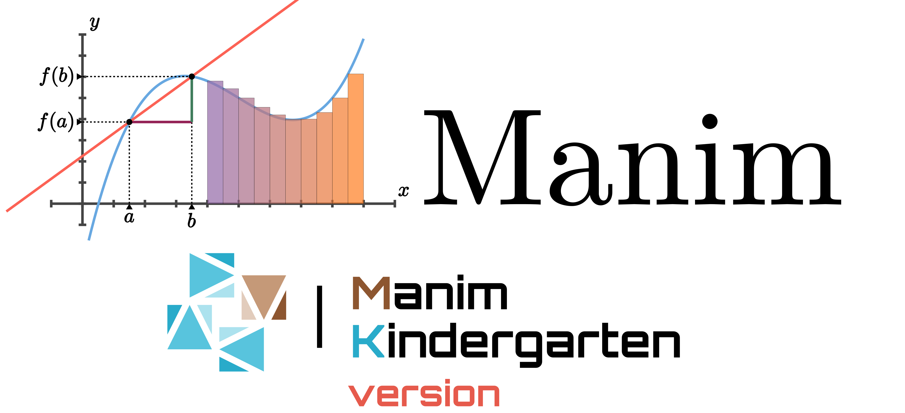

[](https://github.com/manim-kindergarten/manim)

[](http://choosealicense.com/licenses/mit/)
[](https://github.com/manim-kindergarten/manim_sandbox/)
[](https://space.bilibili.com/171431343/favlist?fid=947158443)
[](https://manim-kindergarten.github.io/manim_document_zh/)


原README文件: [3b1b/manim](https://github.com/3b1b/manim/blob/master/README.md)

Manim是一个用于制作视频的动画引擎。它用编程的方式创建精确的动画，如[3Blue1Brown](https://www.3blue1brown.com/).

这个存储库是[3b1b/manim](https://github.com/3b1b/manim)的一个fork版本，由[manim-kindergarten](https://github.com/manim-kindergarten)成员管理维护，目的在于给manim使用者(特别是在中国)提供一个可用、整洁的manim库。如果是MK成员或初学者，推荐使用这个库中的源码。

对于一些MK成员编写的常用类与函数，和制作视频的源代码，可以去旁边的存储库[manim_sandbox](https://github.com/manim-kindergarten/manim_sandbox/)中查看

## 教程及文档(中文)

### 中文安装指南
- [一视数学卷毛杨的专栏教程](https://www.bilibili.com/read/cv4139851)
- [一视数学卷毛杨的互动版视频教程](https://www.bilibili.com/video/BV1ap4y1C7NF)
- [pdcxs的专栏教程](https://www.bilibili.com/read/cv3387999)
- [pdcxs关于vscode自动运行脚本的教程](https://www.bilibili.com/read/cv4152112)

关于安装后在IDE中颜色会提示错误，尝试按照[manim_sandbox的wiki中constants页面](https://github.com/manim-kindergarten/manim_sandbox/wiki/constants%E5%B8%B8%E9%87%8F)最下方所说处理

### 中文教程
- [mk制作的视频教程(更新中)](https://space.bilibili.com/171431343/favlist?fid=947158443)
- [cigar666的专栏教程文集](https://www.bilibili.com/read/readlist/rl82339)
- [pdcxs转载自Elteoremadebeethoven的英文教程](https://www.bilibili.com/video/av64023740)(因为YouTube在中国大陆无法访问)
- [cai-hust的中文教程](https://github.com/cai-hust/manim-tutorial-CN)

在使用中针对你可能会出现的常见问题，这里有一个文档：[manim常见问题v2.2](https://github.com/manim-kindergarten/manim_sandbox/blob/master/documents/manim%E5%B8%B8%E8%A7%81%E9%97%AE%E9%A2%98v2.2.pdf)，如果无法在线打开预览，[点此下载](https://github.com/manim-kindergarten/manim_sandbox/blob/master/documents/manim%E5%B8%B8%E8%A7%81%E9%97%AE%E9%A2%98v2.2.pdf?raw=True)<br>
如果你想通过视频代码来学习，你可以尝试运行[manim_sandbox](https://github.com/manim-kindergarten/manim_sandbox/)中[videos](https://github.com/manim-kindergarten/manim_sandbox/tree/master/videos)和[demo](https://github.com/manim-kindergarten/manim_sandbox/tree/master/demo)文件夹中的代码

### 中文文档
- [Tridu整理、翻译自英文文档的中文文档](https://manim-kindergarten.github.io/manim_document_zh/)
- [manim_sandbox中的wiki（未完成，仅一部分）](https://github.com/manim-kindergarten/manim_sandbox/wiki)
- [manim常见问题v2.2](https://github.com/manim-kindergarten/manim_sandbox/blob/master/documents/manim%E5%B8%B8%E8%A7%81%E9%97%AE%E9%A2%98v2.2.pdf)

## 关于更改(相对于[3b1b/manim](https://github.com/3b1b/manim))
1. 删除了一些针对travis，pypi的文件
2. 删除了在使用manim时无影响的英文文档源码
3. 删除了对使用无影响的logo文件夹
4. 添加了assets素材文件夹
5. 针对中文使用者的更改: `TEX_USE_CTEX=True`
6. 添加了一些成员编写的新功能或修复:
    - `plot_depth`: 解决图层问题
    - 还原了Grant觉得不好的gif导出
    - 修复了`SVGMobject`的默认`stroke_width=0`
    - 修复了在Windows下可能会出现的路径问题

这个库也会和[3b1b/manim](https://github.com/3b1b/manim)保持更新

## 关于[manim_kindergarten](https://github.com/manim-kindergarten/)
更多内容可以去[manim_sandbox](https://github.com/manim-kindergarten/manim_sandbox/)的[README](https://github.com/manim-kindergarten/manim_sandbox/blob/master/README.md)中查看<br>
如果你想要使用[manim_sandbox](https://github.com/manim-kindergarten/manim_sandbox/)中的内容，只需要将其clone到manim文件夹内(与manim.py和manimlib同级)，并且使用下面的语句导入utils中的内容
```python
from manim_sandbox.utils.imports import *
```

#### 加入我们
这个是我们的QQ群号: 862671480 欢迎您的加入<br>
目前的入群问题: https://paste.ubuntu.com/p/vCTRShkKN7/ (主要考察对python基础语法的掌握)


最后，祝大家好运ღ( ´･ᴗ･` )
------------------
